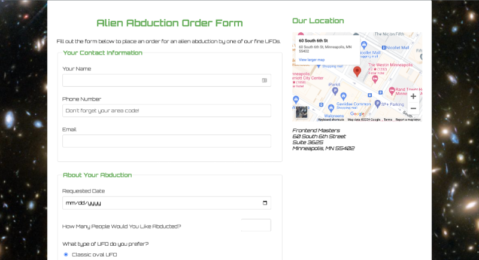

# Alien Abduction Order Form

## Introduction

This project is a part of the Frontend Masters Bootcamp. It focuses on HTML forms, specifically the lessons dedicated to HTML forms. This is me diving back into the basics to ensure I haven't missed anything and to hone my skills.

## Project Structure

- **begin/**: Contains the initial setup of the project.
  - **css/**: Stylesheets with a modern, alien-themed design.
  - **img/**: Images used in the project.
  - **js/**: JavaScript files for backend form submission.
  - **forms.html**: Initial HTML file.
- **end/**: Contains the final version of the project provided by the instructor.

## Features

- **HTML Forms**: Demonstrates the use of various form elements including text input, radio buttons, checkboxes, and select dropdowns.
- **Styling**: Custom CSS for a modern, alien-themed design.
- **Responsive Design**: Ensures the form is accessible and functional on various devices.
- **JavaScript**: Used to connect with backend submission for form functionality and email notifications.

## Technologies Used

- **HTML5**: For creating the structure of the web page.
- **CSS3**: For styling the form elements and layout with a unique alien-themed design.
- **JavaScript**: For backend form submission to ensure functionality and email notifications.

## Acknowledgements

This project is part of the Frontend Masters Bootcamp, specifically focusing on HTML forms lessons. Special thanks to the instructors for providing valuable lessons and resources. Learn more at [Frontend Masters Bootcamp](https://frontendmasters.com/bootcamp/).
